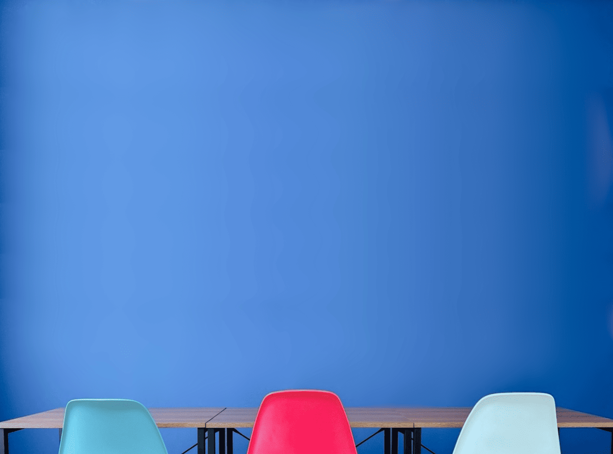

# つばめ学習舎 WEBサイト 編集ガイド

**最終更新: 2025年2月**
**対象読者: 荒井・金田**

---

## はじめに

このドキュメントは、つばめ学習舎のWEBサイトを今後修正・更新する際に必要な情報をまとめたものです。テキストの修正、画像の差し替え、新しいページの追加などを行うときに参照してください。

基本方針として、コードの直接編集は最小限にとどめ、**AIに適切な情報を渡して作業を依頼する**ことを想定しています。そのため、各章では「AIにどう伝えるか」の指示テンプレートも記載しています。

---

## 目次

1. [ファイル構成マップ](#1-ファイル構成マップ)
2. [共通CSSと個別CSSの仕組み](#2-共通cssと個別cssの仕組み)
3. [デザインルール早見表](#3-デザインルール早見表)
4. [よくある編集の手順ガイド](#4-よくある編集の手順ガイド)
5. [公開の仕組みと手順](#5-公開の仕組みと手順)

---

## 1. ファイル構成マップ

### ローカルの作業フォルダ

荒井のPC上のリポジトリフォルダ:
```
Finder > 書類 > swallowbase-website
```

このフォルダの中身がGitHubリポジトリ（swallow-site）と同期しています。GitHub Desktopの「Show in Finder」ボタンからも開けます。

### 全体のフォルダ構造

```
swallowbase-website/        ← ローカルの作業フォルダ
│                             （GitHub上のリポジトリ名: swallow-site）
│
├── README.md               ← この編集ガイド（GitHub上でも閲覧可能）
│
├── docs/                   ← 技術資料フォルダ（サイト公開には影響しない）
│   ├── フォントサイズ規格.md
│   ├── 共通CSS管理パーツ一覧.md
│   └── プログラムページ共通デザインガイド.md
│
├── index.html              ← ホームページ
├── programs.html           ← プログラム一覧
├── course.html             ← 受講プラン
├── about.html              ← つばめ学習舎とは
├── facility.html           ← 校舎紹介
├── voice.html              ← 卒業生の声
├── contact.html            ← 体験入会・お問い合わせ
│
├── programs/               ← プログラム詳細ページ（サブフォルダ）
│   ├── coaching.html       ← コーチング
│   ├── lecture.html        ← 集団指導・個別指導
│   ├── itsudemo.html       ← いつでもつばめ（LINE質問サービス）
│   ├── sparta.html         ← スパルタ・プログラム
│   └── hitoritabi.html     ← ひとり旅プロジェクト
│
├── css/
│   └── style.css           ← 共通CSS（全ページに影響）
│
├── js/
│   └── script.js           ← 共通JS（ハンバーガーメニュー等）
│
└── images/                 ← 画像フォルダ
    ├── favicon.ico         ← ファビコン
    ├── favicon.png         ← Apple Touch Icon
    ├── logo_3.png          ← ヘッダーロゴ
    ├── logo_1b.png         ← ヒーローロゴ（HOMEページ）
    ├── logo-white.png      ← フッターロゴ（白抜き）
    ├── ogp-default.jpg     ← OGP画像（SNSシェア時に表示）
    │
    ├── home/               ← HOMEページ用画像
    ├── programs/           ← プログラム関連画像
    ├── about/              ← つばめ学習舎とは用画像
    ├── facility/           ← 校舎紹介用画像
    ├── voice/              ← 卒業生の声用画像
    ├── course/             ← 受講プラン用画像
    ├── contact/            ← お問い合わせ用画像
    ├── icons/              ← アイコン類（SVG）
    └── designs/            ← Canvaデザイン画像（参考用・公開には不使用）
```

### ファイルの役割一覧

| ファイル | 役割 | 編集する場面 |
|---------|------|------------|
| `index.html` | ホームページ | トップページの内容変更 |
| `programs.html` | プログラム一覧 | プログラムの追加・変更 |
| `programs/coaching.html` | コーチング詳細 | コーチング内容の変更 |
| `programs/lecture.html` | 集団指導・個別指導 | 授業内容の変更 |
| `programs/itsudemo.html` | いつでもつばめ | LINE質問サービスの内容変更 |
| `programs/sparta.html` | スパルタ・プログラム | スパルタの内容変更 |
| `programs/hitoritabi.html` | ひとり旅プロジェクト | ひとり旅の内容変更 |
| `course.html` | 受講プラン | 料金・プラン変更 |
| `about.html` | つばめ学習舎とは | 塾の紹介文変更 |
| `facility.html` | 校舎紹介 | 設備写真・説明の変更 |
| `voice.html` | 卒業生の声 | 卒業生の声の追加・変更 |
| `contact.html` | お問い合わせ | 体験入会情報の変更 |
| `css/style.css` | 共通CSS | デザイン全体の変更（**全ページに影響**） |
| `js/script.js` | 共通JS | ナビ・メニュー等の動作変更 |

### 「どこを触ると何が変わるか」早見表

| やりたいこと | 触るファイル | 影響範囲 |
|------------|------------|---------|
| 特定ページのテキスト変更 | 該当HTMLファイル | そのページだけ |
| 特定ページのデザイン変更 | 該当HTMLファイル内の`<style>`タグ | そのページだけ |
| ヘッダー・フッターの変更 | **全HTMLファイル**の該当箇所 | 全ページ |
| サイト全体の色やフォントの変更 | `css/style.css` | 全ページ |
| セクション見出しのデザイン変更 | `css/style.css`（`.section-heading`） | 全ページ |
| ページヒーローのデザイン変更 | `css/style.css`（`.page-hero`） | HOME以外の全ページ |
| ナビゲーションの項目変更 | **全HTMLファイル**のnav部分 | 全ページ |
| 画像の差し替え | `images/` フォルダ内のファイル | 使用しているページ |
| ハンバーガーメニューの動作変更 | `js/script.js` | 全ページ |

> **重要**: ヘッダー・フッター・ナビゲーションは全ページに同じコードがコピーされています。1ページだけ変更すると他のページと不整合が起きます。必ず全ページ分を変更してください。

---

## 2. 共通CSSと個別CSSの仕組み

### 基本原則

このサイトのCSSは2層構造になっています。

- **共通CSS**（`css/style.css`）: 全ページに共通するデザイン。変更すると全ページに反映される。
- **ページ固有CSS**（各HTML内の`<style>`タグ）: そのページだけのデザイン。変更してもそのページにしか影響しない。

ページ固有CSSは共通CSSより優先されます。同じクラス名に対してページ固有CSSで別のスタイルを指定すると、そのページではページ固有のスタイルが適用されます。

### 共通CSSで管理しているパーツ

`css/style.css` を修正するだけで全ページに反映されるパーツです。

**1. ヘッダー・フッター**

| クラス名 | 用途 |
|---------|------|
| `header` | ヘッダー全体 |
| `.desktop-nav` | PCナビゲーション（1024px以上で表示） |
| `.mobile-menu` | モバイルメニュー |
| `footer` | フッター全体 |

**2. ページヒーローセクション**（HOME以外の全ページ上部の紺色エリア）

| クラス名 | 用途 | 補足 |
|---------|------|------|
| `.page-hero` | ヒーロー背景・余白 | HOMEは独自構造（`.hero`クラス） |
| `.section-title` | 英語タイトル（CONTACT等） | Hammersmith Oneフォント |
| `.page-hero .section-subtitle` | 日本語サブタイトル | |
| `.hero-title-jp` | 日本語タイトル（ひとり旅等） | 特別企画ページで使用 |
| `.hero-label` | ラベル（特別企画等） | サイズはページ固有で設定 |

**3. セクション見出し**（各ページのh2相当）

| クラス名 | 用途 |
|---------|------|
| `.section-heading` | セクション見出し（紺色・中央揃え・下線付き） |

スタイル: `font-weight: bold / color: var(--brand) / text-align: center / padding-bottom: 12px / margin-bottom: 28px / border-bottom: 2px solid var(--brand)`

**4. イントロセクション**（プログラム詳細ページの冒頭部分）

| クラス名 | 用途 | 補足 |
|---------|------|------|
| `.intro-section` | イントロ全体 | モバイル: 縦並び、タブレット以上: 2カラム |
| `.intro-heading` | イントロ見出し | **下線なし**（他セクションと差別化） |
| `.intro-text` | イントロ本文 | |
| `.intro-image-wrapper` | 画像ラッパー | グラデーション付き |

対象ページ: facility, coaching, lecture, itsudemo, sparta, hitoritabi

**5. CTAセクション**（フッター直前の「体験入会・お問い合わせ」ボタン）

| クラス名 | 用途 | 表示条件 |
|---------|------|---------|
| `.cta-section` | CTAセクション | PC（1024px以上）のみ表示 |
| `.cta-button-large` | CTAボタン | 赤色・角丸・影付き |

モバイルではフローティングCTAがあるため、CTAセクション自体は非表示になります。

一部ページではCTAセクションの背景色をページ固有CSSでオーバーライドしています:

| ページ | CTA背景色 |
|--------|----------|
| index.html | 白 |
| contact.html | 白 |
| voice.html | 白 |
| lecture.html | #fae6d3 |
| itsudemo.html | クリーム（var(--bg-cream)） |
| その他 | 透明（デフォルト） |

**6. フローティングCTA**（モバイル用の画面下部固定ボタン）

| クラス名 | 用途 | 表示条件 |
|---------|------|---------|
| `.floating-cta` | 画面下部固定CTA | 1024px未満で表示 |

### ページ固有CSSで管理しているパーツ

以下は各HTMLファイル内の `<style>` タグで定義されています。修正する場合は該当ページのHTMLファイルを編集します。

| ページ | 主な固有パーツ |
|--------|-------------|
| index.html | ヒーローセクション（`.hero`）、フィーチャーカード、卒業生カード横スクロール、アクセス情報 |
| about.html | タイムライン、コンセプトセクション |
| facility.html | ギャラリー、設備カード |
| programs.html | プログラムカード（アコーディオン） |
| course.html | 料金表、プランカード、受講例 |
| voice.html | 卒業生カード（大）、成績アップ表示 |
| contact.html | 入会フロー、体験入会テーブル |
| coaching.html | コーチング特徴カード、当日の流れ |
| lecture.html | 授業概要テーブル |
| itsudemo.html | 利用シーン、LINE質問サンプル画像 |
| sparta.html | プログラム特徴カード、参加者の声 |
| hitoritabi.html | 実施例カード、概要テーブル |

### CSS変数（カラーパレット）

`css/style.css` の冒頭で定義されている変数です。ここを変えると全ページの色が変わります。

```css
:root {
    --brand: #232951;      /* ブランドカラー（紺） */
    --accent: #E11D2F;     /* アクセントカラー（赤） */
    --bg-white: #ffffff;   /* 背景（白） */
    --bg-cream: #f5f5ef;   /* 背景（クリーム） */
}
```

---

## 3. デザインルール早見表

### カラーパレット

| 名称 | カラーコード | 用途 |
|------|-----------|------|
| ブランドカラー（紺） | `#232951` | ヘッダー、ヒーロー、見出し、フッター |
| アクセントカラー（赤） | `#E11D2F` | CTAボタン、強調箇所 |
| 背景（白） | `#ffffff` | メインの背景 |
| 背景（クリーム） | `#f5f5ef` | 交互背景（セクションの区切り） |
| テキスト（黒） | `#000000` | 本文テキスト |
| テキスト（グレー） | `#333333` | 説明文・補足テキスト |

### フォント

| 用途 | フォント名 | フォールバック |
|------|----------|-------------|
| 日本語テキスト全般 | Sawarabi Gothic | sans-serif |
| 英語タイトル（CONTACT等） | Hammersmith One | sans-serif |

フォントはGoogle Fontsから読み込んでいます（各HTMLの`<head>`内に記述）。

### フォントサイズ規格

3段階のレスポンシブ対応:

**見出し系**

| 要素 | モバイル（〜767px） | タブレット（768px〜） | PC（1200px〜） |
|------|-------------------|---------------------|---------------|
| 英語タイトル（CONTACT等） | 32px | 36px | 40px |
| 日本語サブタイトル | 15px | 16px | 17px |
| セクション見出し（h2相当） | 20px | 22px | 24px |
| 項目見出し（h3相当） | 17px | 18px | 20px |
| 小見出し（h4相当） | 16px | 17px | 18px |

**本文系**

| 要素 | モバイル | タブレット | PC |
|------|---------|----------|-----|
| 本文・説明文 | 15px | 16px | 16px |
| 補足・注釈 | 13px | 14px | 14px |
| テーブル本文 | 14px | 15px | 16px |

**ボタン・料金**

| 要素 | モバイル | タブレット | PC |
|------|---------|----------|-----|
| 通常ボタン | 14px | 15px | 16px |
| 大型CTAボタン | 16px | 17px | 18px |
| 金額（大） | 32px | 38px | 44px |

### レスポンシブブレークポイント

| ブレークポイント | 用途 |
|----------------|------|
| **768px** | タブレット開始。フォントサイズ拡大、2カラムレイアウト等 |
| **1024px** | PCナビ表示。フローティングCTA非表示、CTAセクション表示 |
| **1200px** | 大画面対応。フォントサイズ最終拡大 |

### line-height（行間）

原則 **1.7〜1.9** を使用。読みやすさを重視した設定です。

---

## 4. よくある編集の手順ガイド

### 4-1. テキストを変更したい

該当するHTMLファイルを開き、テキスト部分を直接書き換えます。

最も簡単な編集です。HTMLタグ（`<p>`, `<h2>`, `<span>` など）の中のテキストだけを変更すればOKです。

**AIへの指示テンプレート:**
```
○○ページ（○○.html）の「△△」セクションにある
「□□□□□」というテキストを「■■■■■」に変更してください。
```

### 4-2. 画像を差し替えたい

2つの方法があります。

**方法A: 同名ファイルで上書き（簡単）**
新しい画像を同じファイル名にリネームし、`images/` 内の該当フォルダにある古いファイルを上書きします。HTMLの変更は不要です。

**方法B: 別名のファイルに差し替え**
新しい画像を `images/` フォルダに追加し、HTMLの `src` 属性を新しいファイル名に変更します。

**AIへの指示テンプレート:**
```
○○ページ（○○.html）で使用している画像「images/○○/△△.jpg」を
新しい画像「images/○○/□□.jpg」に差し替えてください。
alt属性は「■■■■」にしてください。
```

**画像の配置ルール:**
- 共通画像（ロゴ等）: `images/` 直下
- ページ別画像: `images/ページ名/` に配置
- ファイル名: 英数字とハイフン、アンダースコアのみ。小文字推奨

### 4-3. 新しいページを追加したい

テンプレートファイルを使います。ページの配置場所によって使い分けてください。

| テンプレート | 用途 | パスの基準 |
|------------|------|----------|
| `template-root.html` | ルート直下に置くページ | `css/style.css`, `images/○○` |
| `template-programs.html` | `programs/` フォルダ内に置くページ | `../css/style.css`, `../images/○○` |

2つのテンプレートの違いはパスの書き方だけです。`programs/` フォルダ内のページは1階層深いので、共通ファイルへのパスに `../` が付きます。

**手順:**
1. テンプレートファイルをコピーして新しいファイル名にする
2. `<title>` と `<meta description>` を変更する
3. ヒーローセクションの英語タイトル・日本語サブタイトルを変更する
4. ページの内容をコーディングする
5. 全ページのナビゲーションに新しいページへのリンクを追加する

**AIへの指示テンプレート:**
```
つばめ学習舎WEBサイトの新しいページを作りたいです。

【ページ情報】
- ページ名: ○○○○
- ファイル名: ○○.html
- 配置場所: ルート直下 / programs/ フォルダ内
- テンプレート: template-root.html / template-programs.html を使用

【内容】
（ページに掲載したいテキスト・構成を記述）

【参考にしてほしい既存ページ】
○○.htmlのレイアウトを参考にしてください。

既存ページとの統一感を保つため、プロジェクトの共通CSSやデザインルールに従って作成してください。
```

### 4-4. ヘッダー・フッターを変更したい

ヘッダーとフッターは全ページに同じHTMLがコピーされているため、変更する場合は**全12ファイル**を更新する必要があります。

**対象ファイル一覧（12ファイル）:**
- ルート直下（7ファイル）: index.html, programs.html, course.html, about.html, facility.html, voice.html, contact.html
- programs/ フォルダ内（5ファイル）: coaching.html, lecture.html, itsudemo.html, sparta.html, hitoritabi.html

**AIへの指示テンプレート:**
```
つばめ学習舎WEBサイトのヘッダー（またはフッター）を変更したいです。

【変更内容】
○○○○

全12ページ分のHTMLを一括で更新してください。
programs/ フォルダ内のページはパスが「../」始まりになる点に注意してください。
```

### 4-5. 卒業生の声を追加したい

voice.html に新しい卒業生カードを追加します。

**AIへの指示テンプレート:**
```
voice.html に新しい卒業生の声を追加してください。

【卒業生情報】
- 名前（表示名）: ○○さん
- 大学・合格先: ○○大学 合格
- タイトル（一言）: ○○○○
- 本文: ○○○○○○○○

既存の卒業生カードと同じデザイン・構造で追加してください。
```

### 4-6. 受講プランや料金を変更したい

course.html の料金テーブルや説明文を修正します。

**AIへの指示テンプレート:**
```
course.html の料金表を更新してください。

【変更内容】
- ○○コースの月額を △△円 → □□円 に変更
- （その他変更があれば記述）
```

---

## 5. 公開の仕組みと手順

### 公開の全体像

```
【ローカルPC】          【GitHub】              【Netlify】           【インターネット】
ファイルを編集  →  GitHub Desktop  →  swallow-site  →  自動で検知・  →  サイトが
                  でPush            リポジトリ        ビルド・公開       更新される
                  (main ブランチ)
```

**役割の整理:**
- **GitHub Desktop**: ファイルの変更を管理し、GitHubに送信（Push）するためのアプリ
- **GitHub**: コードを保管するリモートリポジトリ（swallow-site）。変更履歴も保存される
- **Netlify**: GitHubリポジトリを監視し、変更があると自動でサイトを公開してくれるホスティングサービス。ドメイン設定やSSL証明書の管理もここ

つまり、**私たちがやるのは「ファイルを編集して、GitHub DesktopでPushする」だけ**です。あとはNetlifyが自動で対応してくれます。

### 公開手順（GitHub Desktop）

**ステップ1: ファイルを編集する**
- Finderでリポジトリのフォルダを開く（GitHub Desktop → 「Show in Finder」）
- 該当するHTML/CSS/画像ファイルを編集・差し替えする

**ステップ2: 変更を確認する**
- GitHub Desktopを開く
- 左側の「Changes」タブに変更したファイルが表示される
- 変更内容を確認する（差分が表示される）

**ステップ3: コミットする**
- 左下の「Summary (required)」に変更内容のメモを入力する
  - 例: 「about.htmlのテキスト修正」「voice.htmlに卒業生追加」
- 「Commit to main」ボタンをクリック

**ステップ4: Pushする**
- 画面上部の「Push origin」ボタンをクリック
- これでGitHubにファイルが送信される

**ステップ5: 公開を待つ**
- Netlifyが自動でGitHubの変更を検知する
- 通常1〜2分程度でサイトに反映される
- 実際のサイトURLにアクセスして確認する

### 編集ファイルの場所

ローカルのリポジトリフォルダは `Finder > 書類 > swallowbase-website` です。GitHub Desktopの「Show in Finder」ボタンからも開けます。

テキストエディタ（Visual Studio Code等）がインストールされていれば「Open in Visual Studio Code」ボタンからも開けます。

### コミットメッセージの書き方（参考）

変更内容がわかるよう簡潔に書きます。日本語でOKです。

- `about.htmlのテキスト修正`
- `卒業生の声を1件追加`
- `料金表の更新（2025年4月〜）`
- `校舎紹介の写真差し替え`
- `ヘッダーナビに新ページ追加`

### 変更を元に戻したい場合

**コミット前（まだPushしていない）**: GitHub Desktopの「Changes」タブで、ファイルを右クリック → 「Discard Changes」で元に戻せます。

**コミット後・Push後**: GitHub Desktopの「History」タブから過去の状態を確認できます。複雑な巻き戻しが必要な場合はAIに相談してください。

### Netlifyについて補足

Netlifyはサイトのホスティング（公開）を担当しています。普段の更新作業でNetlifyの管理画面を操作する必要はありません。

Netlifyの管理画面が必要になるのは以下のような場合です:
- 独自ドメインの設定変更
- SSL証明書の確認
- デプロイ（公開処理）の状態確認・エラー確認
- リダイレクト設定

### 金田が別のPCから編集する場合

荒井のPCを使わなくても、金田のPCから編集・公開ができます。

**方法A: 金田のPCにもリポジトリをクローンする（推奨）**

1. 金田のPCに GitHub Desktop をインストールする
2. 荒井がGitHubの swallow-site リポジトリの設定から、金田のGitHubアカウントを「コラボレーター」として招待する（Settings → Collaborators → Add people）
3. 金田がGitHub Desktopで swallow-site リポジトリを「Clone」する
4. 以降は荒井と同じ手順（編集→コミット→Push）で作業できる

**注意点**: 2人が同時に同じファイルを編集すると「コンフリクト（競合）」が発生する可能性があります。作業前に「Fetch origin」で最新状態を取得する習慣をつけてください。

**方法B: GitHubのWebサイトから直接編集する（軽微な修正向け）**

ブラウザでGitHubのリポジトリページ（swallow-site）を開き、ファイルを選択して鉛筆アイコンから直接編集できます。テキストの軽微な修正にはこれで十分です。

### このガイドと技術資料の保管場所

**この編集ガイド（README.md）**

| 保管場所 | ファイル名 | メリット |
|---------|----------|---------|
| リポジトリ直下 | `README.md` | GitHubリポジトリのトップページに自動表示される。金田もブラウザで閲覧可能 |
| Googleドライブ | 任意 | バックアップ。ブラウザから手軽に確認可能 |

→ **両方に置く**のがおすすめです。

**技術資料（フォントサイズ規格.md 等）**

リポジトリ内に `docs/` フォルダを作り、そこに配置します。

```
swallowbase-website/
├── docs/
│   ├── フォントサイズ規格.md
│   ├── 共通CSS管理パーツ一覧.md
│   └── プログラムページ共通デザインガイド.md
├── index.html
├── ...
```

`docs/` フォルダはサイトの公開には一切影響しません（Netlifyは HTML/CSS/JS/画像だけを公開するため）。技術資料がコードと同じ場所で管理され、GitHubにPushすればブラウザからも閲覧できます。Googleドライブにも同じものを保管しておけば二重バックアップになります。

---

## 付録: パス記述のルール

このサイトでは**相対パス**を使用しています。ページの配置場所によってパスの書き方が変わります。

### ルート直下のページから（index.html, about.html 等）

```html
<!-- CSS -->
<link rel="stylesheet" href="css/style.css">

<!-- JS -->
<script src="js/script.js"></script>

<!-- 画像 -->



<!-- リンク -->
<a href="about.html">つばめ学習舎とは</a>
<a href="programs/coaching.html">コーチング</a>
```

### programs/ フォルダ内のページから（coaching.html, lecture.html 等）

```html
<!-- CSS（1階層上に戻る） -->
<link rel="stylesheet" href="../css/style.css">

<!-- JS -->
<script src="../js/script.js"></script>

<!-- 画像 -->


<!-- リンク（ルート直下のページ） -->
<a href="../index.html">ホーム</a>
<a href="../contact.html">お問い合わせ</a>

<!-- リンク（同じフォルダ内のページ） -->
<a href="lecture.html">授業</a>
```

### よくあるパスのミス

- ❌ `/css/style.css`（スラッシュ始まりの絶対パスはNG）
- ❌ `programs/` フォルダ内のページから `css/style.css`（`../` が抜けている）
- ❌ ルートのページから `../images/logo.png`（余計な `../` がある）

---

## 付録: AIに作業を依頼する際の基本情報

新しいチャットでAIにWEBサイトの編集を依頼する際、以下の情報を伝えるとスムーズです。

```
つばめ学習舎のWEBサイト（GitHub Pages + Netlify公開）の編集を手伝ってください。

【サイトの技術構成】
- HTML/CSS/JS のみ（フレームワーク不使用）
- 共通CSS: css/style.css
- 共通JS: js/script.js
- レスポンシブ: モバイルファースト（768px / 1024px / 1200px）
- 相対パスで記述（programs/ フォルダ内は ../ が必要）

【ブランドカラー】
- 紺: #232951 / 赤: #E11D2F / 白: #ffffff / クリーム: #f5f5ef

【フォント】
- 日本語: Sawarabi Gothic / 英語: Hammersmith One

【今回の作業内容】
（ここに具体的な依頼内容を記述）
```

Claude（Anthropic）のプロジェクト機能を使う場合は、プロジェクトにテンプレートや既存HTMLが保存されているので、「プロジェクトの○○.htmlを参照して」と指示すれば、より正確な作業が可能です。

---

*このドキュメントはサイト構成の変更に応じて適宜更新してください。*
